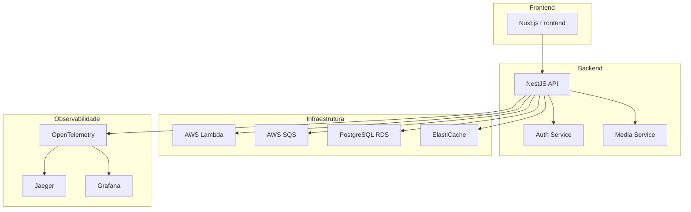
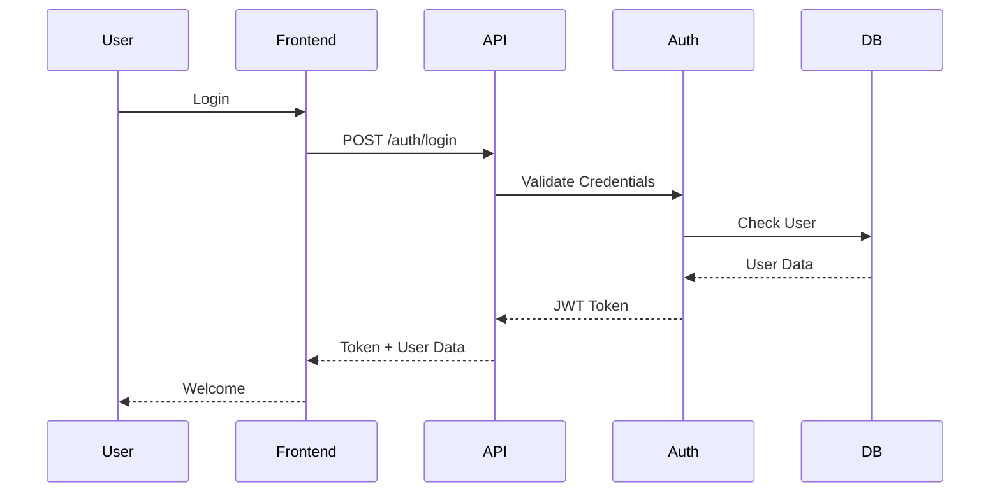
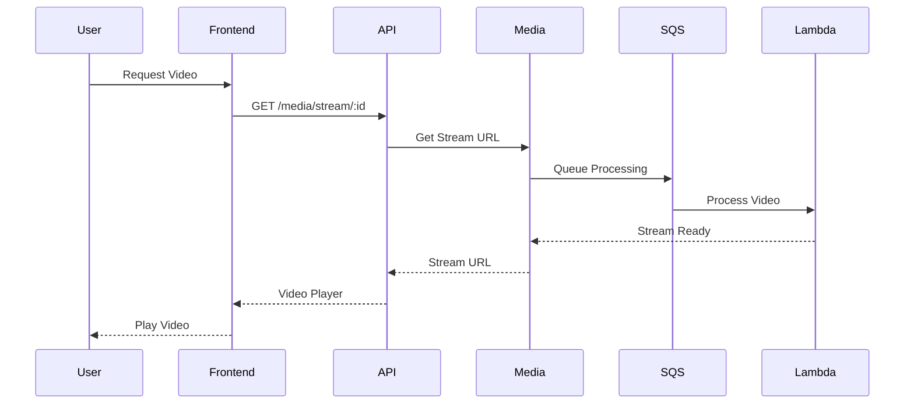

# Arquitetura do AleFlix

> [Diagrama Arquitetural no Draw.io](https://drive.google.com/file/d/1n1EI1ALYbC7QeQhSTsSwan5wOXlSah0r/view?usp=sharing)

## Visão Geral

O AleFlix é uma plataforma de streaming construída com uma arquitetura distribuída e serverless, focada em escalabilidade, resiliência e observabilidade.

## Diagrama de Arquitetura

## Componentes Principais

### Frontend (Nuxt.js)

- Interface responsiva com Vue 3 e Nuxt 3
- Gerenciamento de estado com Pinia
- Estilização com Tailwind CSS e ShadCN-Vue
- Internacionalização (i18n)
- SSR para melhor performance e SEO

### Backend (NestJS)

- API RESTful com Fastify
- Autenticação JWT
- WebSockets para comunicação em tempo real
- Integração com serviços AWS
- Mensageria com SQS

### Infraestrutura

- Serverless com AWS Lambda
- Banco de dados PostgreSQL no RDS
- Cache com ElastiCache
- Mensageria com SQS
- CI/CD com GitHub Actions

### Observabilidade

- Rastreamento distribuído com OpenTelemetry
- Visualização de traces com Jaeger
- Dashboards com Grafana
- Logs estruturados

## Fluxos Principais

### Autenticação

### Streaming de Vídeo

## Decisões Arquiteturais

1. **Serverless First**

   - Escalabilidade automática
   - Pay-per-use
   - Menor overhead operacional

2. **Event-Driven Architecture**

   - Baixo acoplamento
   - Alta resiliência
   - Processamento assíncrono

3. **Observabilidade**

   - Rastreamento distribuído
   - Métricas em tempo real
   - Logs estruturados

4. **Segurança**
   - Autenticação JWT
   - HTTPS everywhere
   - Rate limiting
   - CORS configurado

## Escalabilidade

- Auto-scaling com Lambda
- Cache distribuído
- CDN para assets estáticos
- Load balancing
- Database sharding ready

## Resiliência

- Circuit breakers
- Retry policies
- Fallback mechanisms
- Health checks
- Backup strategies

## Monitoramento

- APM com OpenTelemetry
- Dashboards Grafana
- Alertas configurados
- Log aggregation
- Performance metrics
