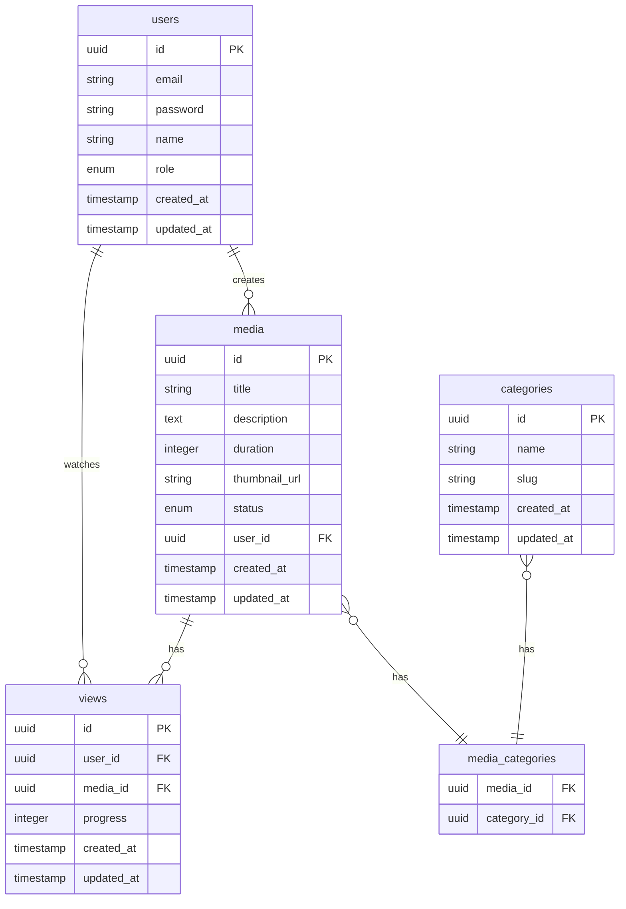

# Documentação do Banco de Dados

## Visão Geral

O StreamFlow utiliza PostgreSQL como banco de dados principal, com suporte a migrações e versionamento de schema.

## Diagrama ERD



## Schemas

### Users

```sql
CREATE TABLE users (
    id UUID PRIMARY KEY DEFAULT gen_random_uuid(),
    email VARCHAR(255) UNIQUE NOT NULL,
    password VARCHAR(255) NOT NULL,
    name VARCHAR(255) NOT NULL,
    role VARCHAR(20) NOT NULL DEFAULT 'USER',
    created_at TIMESTAMP WITH TIME ZONE DEFAULT CURRENT_TIMESTAMP,
    updated_at TIMESTAMP WITH TIME ZONE DEFAULT CURRENT_TIMESTAMP
);
```

### Media

```sql
CREATE TABLE media (
    id UUID PRIMARY KEY DEFAULT gen_random_uuid(),
    title VARCHAR(255) NOT NULL,
    description TEXT,
    duration INTEGER,
    thumbnail_url VARCHAR(255),
    status VARCHAR(20) NOT NULL DEFAULT 'PROCESSING',
    user_id UUID REFERENCES users(id),
    created_at TIMESTAMP WITH TIME ZONE DEFAULT CURRENT_TIMESTAMP,
    updated_at TIMESTAMP WITH TIME ZONE DEFAULT CURRENT_TIMESTAMP
);
```

### Categories

```sql
CREATE TABLE categories (
    id UUID PRIMARY KEY DEFAULT gen_random_uuid(),
    name VARCHAR(255) NOT NULL,
    slug VARCHAR(255) UNIQUE NOT NULL,
    created_at TIMESTAMP WITH TIME ZONE DEFAULT CURRENT_TIMESTAMP,
    updated_at TIMESTAMP WITH TIME ZONE DEFAULT CURRENT_TIMESTAMP
);
```

### Media Categories

```sql
CREATE TABLE media_categories (
    media_id UUID REFERENCES media(id) ON DELETE CASCADE,
    category_id UUID REFERENCES categories(id) ON DELETE CASCADE,
    PRIMARY KEY (media_id, category_id)
);
```

### Views

```sql
CREATE TABLE views (
    id UUID PRIMARY KEY DEFAULT gen_random_uuid(),
    user_id UUID REFERENCES users(id) ON DELETE CASCADE,
    media_id UUID REFERENCES media(id) ON DELETE CASCADE,
    progress INTEGER DEFAULT 0,
    created_at TIMESTAMP WITH TIME ZONE DEFAULT CURRENT_TIMESTAMP,
    updated_at TIMESTAMP WITH TIME ZONE DEFAULT CURRENT_TIMESTAMP
);
```

## Índices

```sql
-- Users
CREATE INDEX idx_users_email ON users(email);
CREATE INDEX idx_users_role ON users(role);

-- Media
CREATE INDEX idx_media_user_id ON media(user_id);
CREATE INDEX idx_media_status ON media(status);
CREATE INDEX idx_media_created_at ON media(created_at);

-- Categories
CREATE INDEX idx_categories_slug ON categories(slug);

-- Views
CREATE INDEX idx_views_user_id ON views(user_id);
CREATE INDEX idx_views_media_id ON views(media_id);
CREATE INDEX idx_views_created_at ON views(created_at);
```

## Migrações

O projeto utiliza TypeORM para gerenciamento de migrações. As migrações são versionadas e podem ser encontradas em:

```
apps/api/src/database/migrations/
```

### Comandos de Migração

```bash
# Criar nova migração
npm run migration:create -- -n NomeDaMigracao

# Executar migrações pendentes
npm run migration:run

# Reverter última migração
npm run migration:revert
```

## Cache

O sistema utiliza Redis (ElastiCache) para cache em diferentes níveis:

1. **Cache de Consultas**

   - Resultados de queries frequentes
   - TTL: 5 minutos

2. **Cache de Sessão**

   - Tokens JWT
   - TTL: 24 horas

3. **Cache de Mídia**
   - Metadados de vídeos
   - TTL: 1 hora

### Estratégia de Cache

```typescript
// Exemplo de implementação
@Injectable()
export class MediaCacheService {
  constructor(@Inject(CACHE_MANAGER) private cacheManager: Cache) {}

  async getMedia(id: string): Promise<Media> {
    const cacheKey = `media:${id}`;
    const cached = await this.cacheManager.get(cacheKey);

    if (cached) {
      return cached;
    }

    const media = await this.mediaRepository.findOne(id);
    await this.cacheManager.set(cacheKey, media, 3600); // 1 hora

    return media;
  }
}
```

## Backup e Recuperação

### Backup Automático

- Backup diário completo
- Backup incremental a cada 6 horas
- Retenção de 30 dias

### Recuperação

```bash
# Restaurar backup
pg_restore -d streamflow backup.dump

# Verificar integridade
pg_verify_checksums -d streamflow
```

## Monitoramento

### Métricas

- QPS (Queries Per Second)
- Latência
- Uso de conexões
- Tamanho do banco
- Cache hit ratio

### Alertas

- Alta latência (> 100ms)
- Erros de conexão
- Espaço em disco < 20%
- Cache miss ratio > 30%
