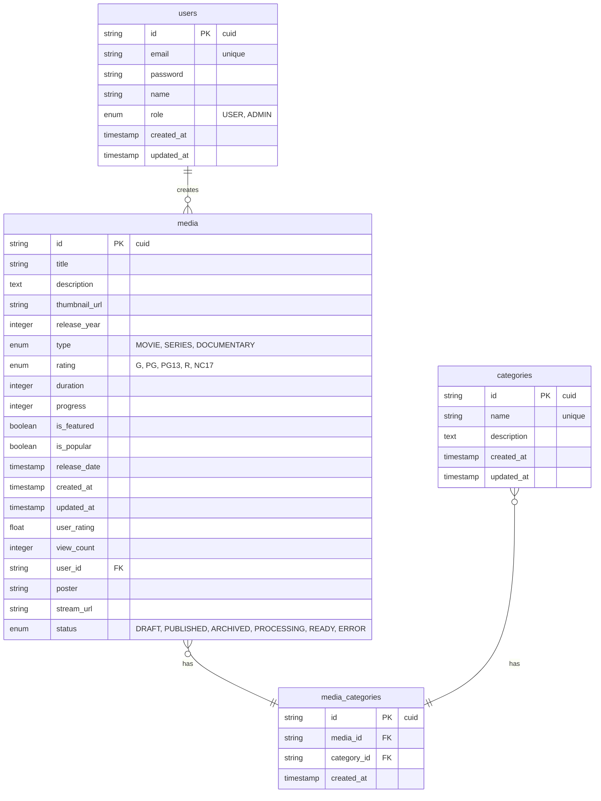

# Documentação do Banco de Dados

## Visão Geral

O AleFlix utiliza PostgreSQL como banco de dados principal, com Prisma como ORM e suporte a migrações e versionamento de schema.

## Diagrama ERD



## Schemas

### Users

```sql
CREATE TABLE users (
    id TEXT PRIMARY KEY DEFAULT gen_random_uuid(),
    email VARCHAR(255) UNIQUE NOT NULL,
    password VARCHAR(255) NOT NULL,
    name VARCHAR(255) NOT NULL,
    role VARCHAR(20) NOT NULL DEFAULT 'USER',
    created_at TIMESTAMP WITH TIME ZONE DEFAULT CURRENT_TIMESTAMP,
    updated_at TIMESTAMP WITH TIME ZONE DEFAULT CURRENT_TIMESTAMP
);
```

### Media

```sql
CREATE TABLE media (
    id TEXT PRIMARY KEY DEFAULT gen_random_uuid(),
    title VARCHAR(255) NOT NULL,
    description TEXT,
    thumbnail_url VARCHAR(255) NOT NULL,
    release_year INTEGER NOT NULL,
    type VARCHAR(20) NOT NULL,
    rating VARCHAR(10) NOT NULL,
    duration INTEGER NOT NULL,
    progress INTEGER,
    is_featured BOOLEAN NOT NULL DEFAULT false,
    is_popular BOOLEAN NOT NULL DEFAULT false,
    release_date TIMESTAMP WITH TIME ZONE,
    created_at TIMESTAMP WITH TIME ZONE DEFAULT CURRENT_TIMESTAMP,
    updated_at TIMESTAMP WITH TIME ZONE DEFAULT CURRENT_TIMESTAMP,
    user_rating DECIMAL(3,2) DEFAULT 0,
    view_count INTEGER NOT NULL DEFAULT 0,
    user_id TEXT NOT NULL REFERENCES users(id),
    poster VARCHAR(255) NOT NULL,
    stream_url VARCHAR(255),
    status VARCHAR(20) NOT NULL DEFAULT 'DRAFT'
);
```

### Categories

```sql
CREATE TABLE categories (
    id TEXT PRIMARY KEY DEFAULT gen_random_uuid(),
    name VARCHAR(255) UNIQUE NOT NULL,
    description TEXT,
    created_at TIMESTAMP WITH TIME ZONE DEFAULT CURRENT_TIMESTAMP,
    updated_at TIMESTAMP WITH TIME ZONE DEFAULT CURRENT_TIMESTAMP
);
```

### Media Categories

```sql
CREATE TABLE media_to_category (
    id TEXT PRIMARY KEY DEFAULT gen_random_uuid(),
    media_id TEXT NOT NULL REFERENCES media(id) ON DELETE CASCADE,
    category_id TEXT NOT NULL REFERENCES categories(id) ON DELETE CASCADE,
    created_at TIMESTAMP WITH TIME ZONE DEFAULT CURRENT_TIMESTAMP,
    UNIQUE(media_id, category_id)
);
```

## Enums

### MediaType

```sql
CREATE TYPE media_type AS ENUM ('MOVIE', 'SERIES', 'DOCUMENTARY');
```

### MediaStatus

```sql
CREATE TYPE media_status AS ENUM ('DRAFT', 'PUBLISHED', 'ARCHIVED', 'PROCESSING', 'READY', 'ERROR');
```

### MediaRating

```sql
CREATE TYPE media_rating AS ENUM ('G', 'PG', 'PG13', 'R', 'NC17');
```

### UserRole

```sql
CREATE TYPE user_role AS ENUM ('USER', 'ADMIN');
```

## Índices

```sql
-- Users
CREATE INDEX idx_users_email ON users(email);
CREATE INDEX idx_users_role ON users(role);

-- Media
CREATE INDEX idx_media_user_id ON media(user_id);
CREATE INDEX idx_media_type ON media(type);
CREATE INDEX idx_media_release_year ON media(release_year);
CREATE INDEX idx_media_is_featured ON media(is_featured);
CREATE INDEX idx_media_is_popular ON media(is_popular);
CREATE INDEX idx_media_release_date ON media(release_date);
CREATE INDEX idx_media_status ON media(status);

-- Categories
CREATE INDEX idx_categories_name ON categories(name);

-- Media Categories
CREATE INDEX idx_media_categories_media_id ON media_to_category(media_id);
CREATE INDEX idx_media_categories_category_id ON media_to_category(category_id);
```

## Migrações

O projeto utiliza Prisma para gerenciamento de migrações. As migrações são versionadas e podem ser encontradas em:

```
apps/api/prisma/migrations/
```

### Comandos de Migração

```bash
# Criar nova migração
npx prisma migrate dev --name NomeDaMigracao

# Executar migrações pendentes
npx prisma migrate deploy

# Resetar banco de dados
npx prisma migrate reset

# Gerar cliente Prisma
npx prisma generate
```

### Migrações Existentes

1. **20250616211245_init** - Criação inicial das tabelas
2. **20250617214757_add_media_and_categories** - Adição de mídia e categorias
3. **20250618123444_update_media_category_to_uuid** - Atualização para UUID
4. **20250618160532_change_rating_to_enum** - Mudança de rating para enum
5. **20250618211822_add_status_and_stream_url_to_media** - Adição de status e stream URL

## Seed Data

O projeto inclui dados de exemplo para testes:

```bash
# Executar seed
npx prisma db seed
```

### Dados de Exemplo

- **Usuários**: Admin e usuários de teste
- **Categorias**: Ação, Comédia, Drama, Documentário, etc.
- **Mídia**: Filmes e documentários de exemplo

## Cache

O sistema utiliza Redis para cache em diferentes níveis:

1. **Cache de Consultas**
   - Resultados de queries frequentes
   - TTL: 5 minutos

2. **Cache de Sessão**
   - Tokens JWT
   - TTL: 1 dia (ou 30 dias com "Lembrar de mim")

3. **Cache de Mídia**
   - Metadados de vídeos
   - TTL: 1 hora

### Estratégia de Cache

```typescript
// Exemplo de implementação
@Injectable()
export class MediaCacheService {
  constructor(@Inject(CACHE_MANAGER) private cacheManager: Cache) {}

  async getMedia(id: string): Promise<Media> {
    const cacheKey = `media:${id}`
    const cached = await this.cacheManager.get(cacheKey)

    if (cached) {
      return cached as Media
    }

    const media = await this.prisma.media.findUnique({
      where: { id },
      include: { categories: true },
    })

    await this.cacheManager.set(cacheKey, media, 3600) // 1 hora
    return media
  }
}
```

## Backup e Recuperação

### Backup Automático

```bash
# Backup do banco
pg_dump -h localhost -U postgres -d ale-flix > backup.sql

# Restaurar backup
psql -h localhost -U postgres -d ale-flix < backup.sql
```

### Estratégia de Backup

- **Backup diário**: 00:00 UTC
- **Retenção**: 30 dias
- **Backup incremental**: A cada 6 horas
- **Teste de recuperação**: Semanal

## Monitoramento

### Métricas Importantes

- **Tempo de resposta das queries**: < 100ms
- **Taxa de cache hit**: > 80%
- **Uso de conexões**: < 80% do pool
- **Tamanho do banco**: Monitoramento de crescimento

### Alertas

- **Tempo de resposta alto**: > 500ms
- **Taxa de erro**: > 1%
- **Espaço em disco**: < 20% livre
- **Conexões ativas**: > 90% do pool
