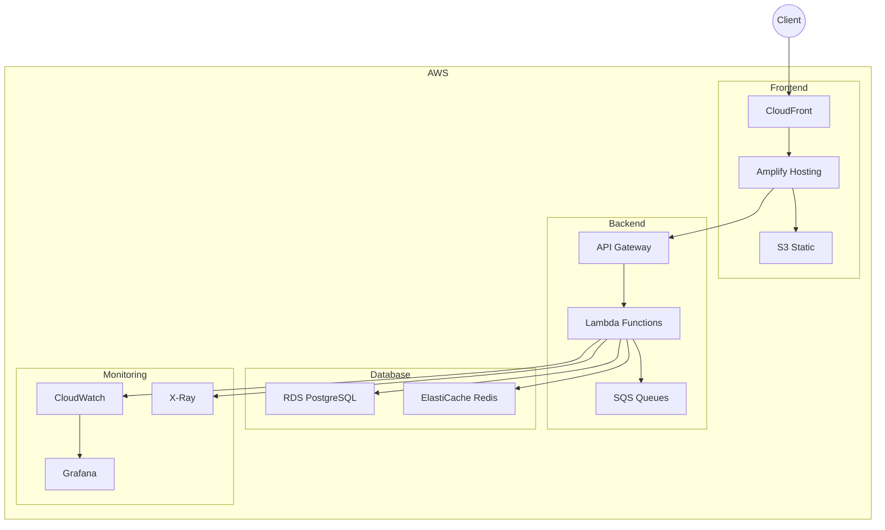

# Documentação de Deploy

## Visão Geral

O StreamFlow utiliza uma infraestrutura serverless na AWS, com CI/CD automatizado via GitHub Actions.

## Infraestrutura

### Diagrama de Infraestrutura



## AWS CDK

### Stack Principal

```typescript
export class StreamFlowStack extends cdk.Stack {
  constructor(scope: cdk.App, id: string, props?: cdk.StackProps) {
    super(scope, id, props);

    // VPC
    const vpc = new ec2.Vpc(this, "StreamFlowVPC", {
      maxAzs: 2,
    });

    // RDS
    const database = new rds.DatabaseInstance(this, "Database", {
      engine: rds.DatabaseInstanceEngine.postgres({
        version: rds.PostgresEngineVersion.VER_14,
      }),
      vpc,
      instanceType: ec2.InstanceType.of(
        ec2.InstanceClass.T3,
        ec2.InstanceSize.MICRO
      ),
    });

    // ElastiCache
    const cache = new elasticache.CfnCacheCluster(this, "Cache", {
      engine: "redis",
      cacheNodeType: "cache.t3.micro",
      numCacheNodes: 1,
    });

    // API Gateway
    const api = new apigateway.RestApi(this, "StreamFlowAPI", {
      restApiName: "StreamFlow API",
      description: "API for StreamFlow platform",
    });

    // Lambda Functions
    const mediaFunction = new lambda.Function(this, "MediaFunction", {
      runtime: lambda.Runtime.NODEJS_20_X,
      handler: "index.handler",
      code: lambda.Code.fromAsset("lambda/media"),
      vpc,
      environment: {
        DATABASE_URL: database.instanceEndpoint.socketAddress,
        REDIS_URL: cache.attrRedisEndpointAddress,
      },
    });

    // SQS Queue
    const mediaQueue = new sqs.Queue(this, "MediaQueue", {
      visibilityTimeout: cdk.Duration.seconds(300),
    });

    // Integrations
    api.root
      .addResource("media")
      .addMethod("GET", new apigateway.LambdaIntegration(mediaFunction));

    mediaQueue.grantSendMessages(mediaFunction);
    database.grantConnect(mediaFunction);
  }
}
```

## CI/CD

### GitHub Actions

```yaml
name: Deploy

on:
  push:
    branches: [main]
  pull_request:
    branches: [main]

jobs:
  deploy:
    runs-on: ubuntu-latest

    steps:
      - uses: actions/checkout@v2

      - name: Setup Node.js
        uses: actions/setup-node@v2
        with:
          node-version: "20"

      - name: Install dependencies
        run: npm ci

      - name: Run tests
        run: npm run test

      - name: Build
        run: npm run build

      - name: Deploy to AWS
        if: github.ref == 'refs/heads/main'
        env:
          AWS_ACCESS_KEY_ID: ${{ secrets.AWS_ACCESS_KEY_ID }}
          AWS_SECRET_ACCESS_KEY: ${{ secrets.AWS_SECRET_ACCESS_KEY }}
        run: npm run cdk deploy
```

## Ambientes

### Desenvolvimento

```bash
# Deploy para ambiente de desenvolvimento
npm run cdk deploy -- --profile dev

# URL: https://dev.streamflow.com
```

### Staging

```bash
# Deploy para ambiente de staging
npm run cdk deploy -- --profile staging

# URL: https://staging.streamflow.com
```

### Produção

```bash
# Deploy para ambiente de produção
npm run cdk deploy -- --profile prod

# URL: https://streamflow.com
```

## Monitoramento

### CloudWatch

```typescript
// Exemplo de métricas personalizadas
const metric = new cloudwatch.Metric({
  namespace: "StreamFlow",
  metricName: "VideoProcessingTime",
  dimensionsMap: {
    Environment: process.env.NODE_ENV,
  },
  unit: cloudwatch.Unit.MILLISECONDS,
});

// Adicionar métrica
metric.putMetricData({
  timestamp: new Date(),
  value: processingTime,
});
```

### X-Ray

```typescript
// Instrumentação de traces
import { captureAsyncFunc } from "aws-xray-sdk";

const processVideo = async (videoId: string) => {
  return captureAsyncFunc("ProcessVideo", async (subsegment) => {
    try {
      // Processamento do vídeo
      subsegment.addAnnotation("videoId", videoId);
      subsegment.addMetadata("processingTime", processingTime);
    } finally {
      subsegment.close();
    }
  });
};
```

## Backup e Recuperação

### RDS

```bash
# Backup automático
aws rds create-db-snapshot \
  --db-instance-identifier streamflow-db \
  --db-snapshot-identifier streamflow-backup-$(date +%Y%m%d)

# Restaurar backup
aws rds restore-db-instance-from-db-snapshot \
  --db-instance-identifier streamflow-db-restore \
  --db-snapshot-identifier streamflow-backup-20240315
```

### S3

```bash
# Backup de assets
aws s3 sync s3://streamflow-assets s3://streamflow-backup/assets

# Restaurar assets
aws s3 sync s3://streamflow-backup/assets s3://streamflow-assets
```

## Segurança

### IAM

```typescript
// Exemplo de política IAM
const lambdaRole = new iam.Role(this, "LambdaRole", {
  assumedBy: new iam.ServicePrincipal("lambda.amazonaws.com"),
});

lambdaRole.addToPolicy(
  new iam.PolicyStatement({
    effect: iam.Effect.ALLOW,
    actions: ["sqs:SendMessage", "sqs:ReceiveMessage", "sqs:DeleteMessage"],
    resources: [mediaQueue.queueArn],
  })
);
```

### WAF

```typescript
// Configuração do WAF
const waf = new wafv2.CfnWebACL(this, "StreamFlowWAF", {
  defaultAction: { allow: {} },
  scope: "REGIONAL",
  visibilityConfig: {
    cloudWatchMetricsEnabled: true,
    metricName: "StreamFlowWAF",
    sampledRequestsEnabled: true,
  },
  rules: [
    {
      name: "RateLimit",
      priority: 1,
      statement: {
        rateBasedStatement: {
          limit: 2000,
          aggregateKeyType: "IP",
        },
      },
      action: { block: {} },
      visibilityConfig: {
        cloudWatchMetricsEnabled: true,
        metricName: "RateLimit",
        sampledRequestsEnabled: true,
      },
    },
  ],
});
```

## Escalabilidade

### Auto Scaling

```typescript
// Configuração de auto scaling
const scaling = new applicationautoscaling.ScalableTarget(
  this,
  "ScalingTarget",
  {
    minCapacity: 1,
    maxCapacity: 10,
    resourceId: `service/${cluster.clusterName}/${service.serviceName}`,
    scalableDimension: "ecs:service:DesiredCount",
    serviceNamespace: applicationautoscaling.ServiceNamespace.ECS,
  }
);

scaling.scaleOnCpuUtilization("CpuScaling", {
  targetUtilizationPercent: 70,
  scaleInCooldown: cdk.Duration.seconds(60),
  scaleOutCooldown: cdk.Duration.seconds(60),
});
```

### Load Balancing

```typescript
// Configuração do load balancer
const lb = new elbv2.ApplicationLoadBalancer(this, "LB", {
  vpc,
  internetFacing: true,
});

const listener = lb.addListener("Listener", {
  port: 80,
});

listener.addTargets("Target", {
  port: 80,
  targets: [service],
  healthCheck: {
    path: "/health",
  },
});
```
